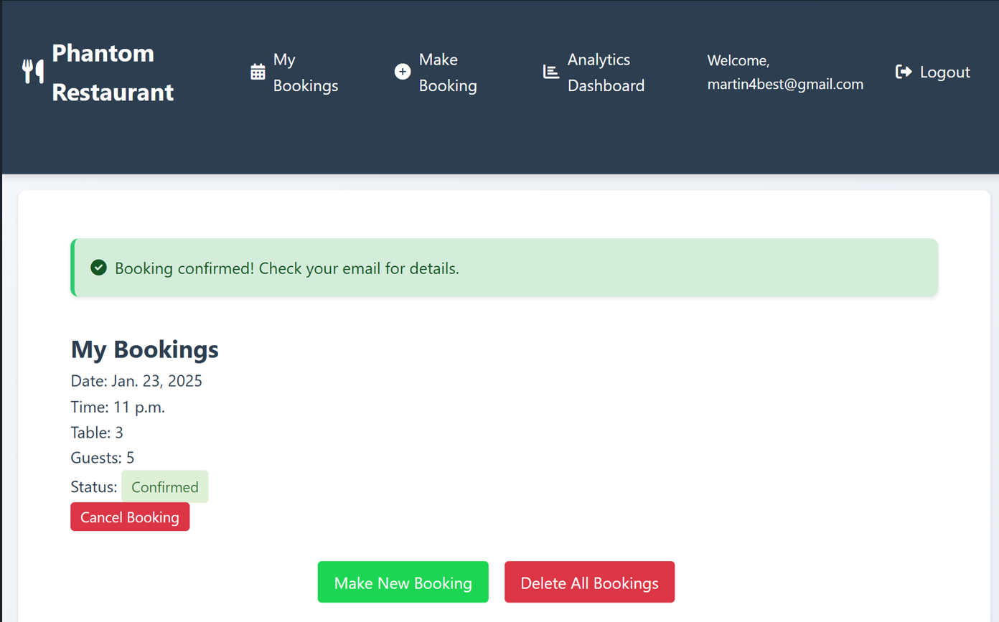

# PHANTOM RESTAURANT BOOKING SYSTEM
The Restaurant Booking System is a sophisticated Django-based web application designed to streamline restaurant table reservations and management. This system offers a seamless experience for both customers and restaurant staff, featuring real-time table availability, booking management, and comprehensive analytics.
The platform allows registered users to make restaurant reservations, manage their bookings, and provide feedback about their dining experience. For restaurant staff, it provides powerful tools to track bookings, analyze customer patterns, and monitor revenue metrics through an intuitive dashboard.

 Here is the link to the Restaurant Booking System-heroku where every bookings are being made [link](https://restaurant-project-524b51fc1cda.herokuapp.com/)


  

### This is Portfolio Project 4 for Full Stack Developer Diploma taught through Code Institute

# Key Features
- User authentication and personalized booking management
- Real-time table availability checking
- Automated booking confirmation system
- Detailed analytics and revenue tracking
- Customer feedback collection
- Comprehensive booking management (create, view, cancel, delete)
- Staff dashboard for monitoring business metrics

## Table of Contents

- [Introduction](#Intoduction)
- [Key Features](#Key-Features)
- [UX - layout](#UX-layout)
- [Installation and Setup](#Installation-and-Setup)
   - [Prerequisites](#Prerequisites)
   - [Clone the Repository](#Clone-the-Repository)
   - [Environment Setup](#Environment-Setup)
   - [Database Configuration](#Database-Configuration)
   - [Running the Application](#Running-the-Application)
   - [Running Tests](#Running-Tests)


## UX - layout
### Login Page
This is the first page you see when opening the site, it has a responsive design so that it displays differently for different sized screens, the version shown here is for a Large screen.


### Main Page
This is the next and the main booking page you will see after logging into the website with username and password.


### Make Booking Page
This is the page where every bookings are being made, and it is linked to User and Table, which includes ```Booking_date, Booking_time, and Number_of_guests``` and after the data has been inputted a ```status with options: confirmed or cancelled.```


### My Booking Page
This page is where all my bookings are being stored and it is a page where I can also cancel any bookings that the customers don't need anymore. It is also the page where I can delete and cancel all bookings if the customers dont need the bookings.


### Booking Analytics Page
This is the page that Summarizes every booking trends such as the ```total_bookings, confirmed_bookings, cancelled_bookings,Customer_Feedback such as (rating (1-5 scale) and optional comment.), RevenueMetrics such as (Daily revenue, average revenue per booking, and per guest.)```
This page also provides the insights into customer behavior such as the Total bookings, cancellations, spending, and dining preferences.


### NavBar
It has a fully functional navbar:
Large screen version


Small screen version


You can see that every icons still appears on the NavBar, such as making a booking, viewing every of your booking confirmations you have made, and view the analytical page for every booking trends you have made so far, such as Total Revenue, Average Revenue per Booking and Total Guests etc.
Everytime a booking is made, it says ```booking confirmed! Check your Email for details```



immediately you received the confirmation email, it will automatically be updated on the admin panel, and the analytical dashboard

### Analytical Dashboard


### Admin Dashboard


### Delete All Bookings
Although if the customer want to cancel every booking, you have to scroll down to my bookings page, by highlighting ```Delete All Bookings```button below which will take you to a warning page for confirmation, before making a final decision.


## Installation and Setup


