# PHANTOM RESTAURANT BOOKING SYSTEM
The Restaurant Booking System is a sophisticated Django-based web application designed to streamline restaurant table reservations and management. This system offers a seamless experience for both customers and restaurant staff, featuring real-time table availability, booking management, and comprehensive analytics.
The platform allows registered users to make restaurant reservations, manage their bookings, and provide feedback about their dining experience. For restaurant staff, it provides powerful tools to track bookings, analyze customer patterns, and monitor revenue metrics through an intuitive dashboard.

 Here is the link to the Restaurant Booking System-heroku where every bookings are being made [link](https://restaurant-project-524b51fc1cda.herokuapp.com/)


  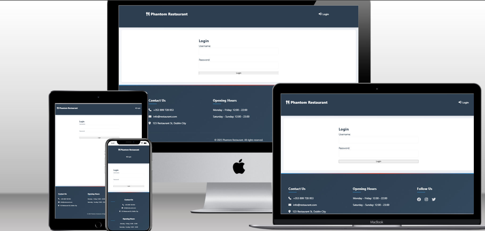

### This is Portfolio Project 4 for Full Stack Developer Diploma taught through Code Institute

# Key Features
- User authentication and personalized booking management
- Real-time table availability checking
- Automated booking confirmation system
- Detailed analytics and revenue tracking
- Customer feedback collection
- Comprehensive booking management (create, view, cancel, delete)
- Staff dashboard for monitoring business metrics

## Table of Contents

- [Introduction](#Intoduction)
- [Key Features](#Key-Features)
- [UX - layout](#UX-layout)
   - [Login Page](#Login-Page)
   - [Main Page](#Main-Page)
   - [Make Booking Page](#Make-Booking-Page)
   - [My Booking Page](#My-Booking-Page)
   - [Booking Analytics Page](#Booking-Analytics-Page)
   - [NavBar](#NavBar)
   - [Analytical Dashboard](#Analytical-Dashboard)
   - [Admin Dashboard](#Admin-Dashboard)
   - [Delete All Bookings](#Delete-All-Bookings)
- [Installation and Setup](#Installation-and-Setup)
   - [Prerequisites](#Prerequisites)
   - [Clone the Repository](#Clone-the-Repository)
   - [Environment Setup](#Environment-Setup)
   - [Database Configuration](#Database-Configuration)
   - [Running the Application](#Running-the-Application)
   - [Running Tests](#Running-Tests)
- [Usage](#Usage)
- [Stretch Goals for the Django Restaurant Booking System](#Stretch-Goals-for-the-Django-Restaurant-Booking-System)
   - [Client-Based Stretch Goals ](#Client-Based-Stretch-Goals)
   - [Developer-Based Stretch Goals](#Developer-Based-Stretch-Goals)
- [Development Plan for Phantom Restaurant System](#Development-Plan-for-Phantom-Restaurant-System)
- [Entity Relationship Diagram](#Entity-Relationship-Diagram)
   - [DBdiagram Charts](#DBdiagram-Charts)
   - [Relationship](#Relationship)
- [Design](#Design)


## UX - layout
   ### Login Page
   This is the first page you see when opening the site, it has a responsive design so that it displays differently for different sized screens, the version shown here is for a Large screen.

   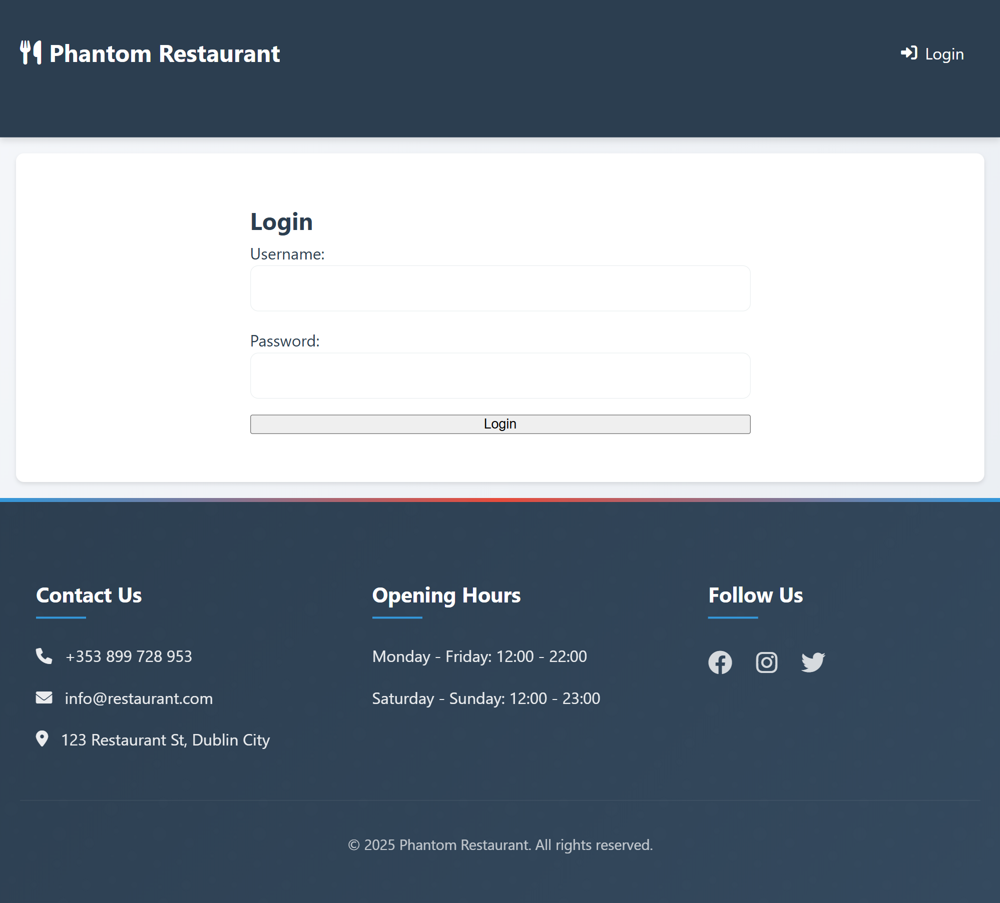

   ### Main Page
   This is the next and the main booking page you will see after logging into the website with username and password.

   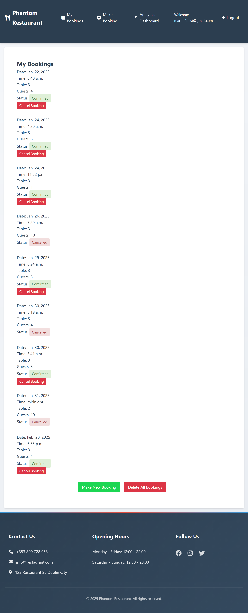

   ### Make Booking Page
   This is the page where every bookings are being made, and it is linked to User and Table, which includes ```Booking_date, Booking_time, and Number_of_guests``` and after the data has been inputted a ```status with options: confirmed or cancelled.```

   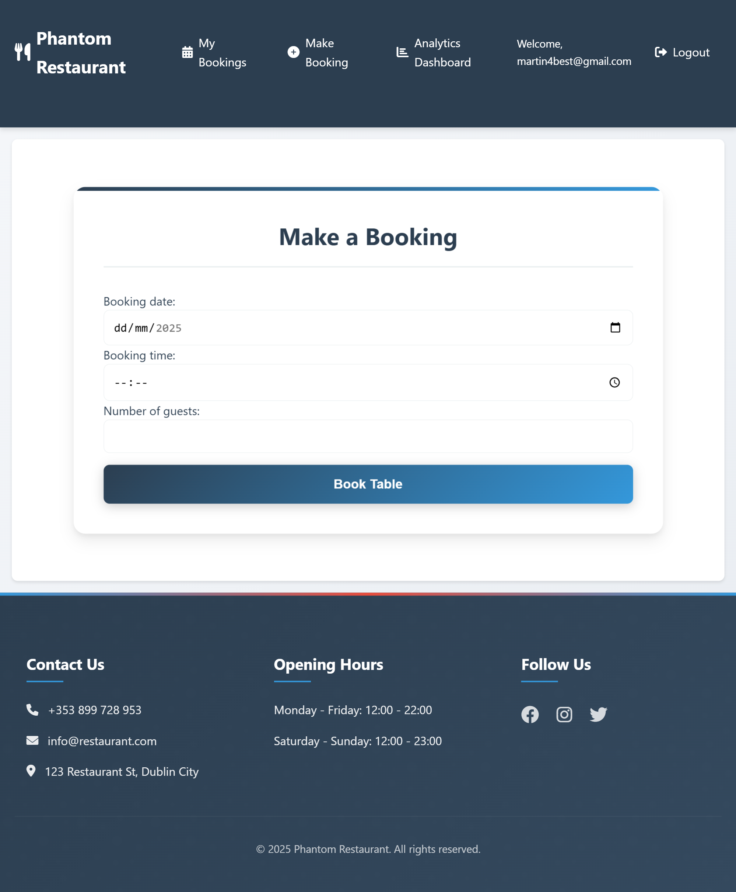

   ### My Booking Page
   This page is where all my bookings are being stored and it is a page where I can also cancel any bookings that the customers don't need anymore. It is also the page where I can delete and cancel all bookings if the customers dont need the bookings.

   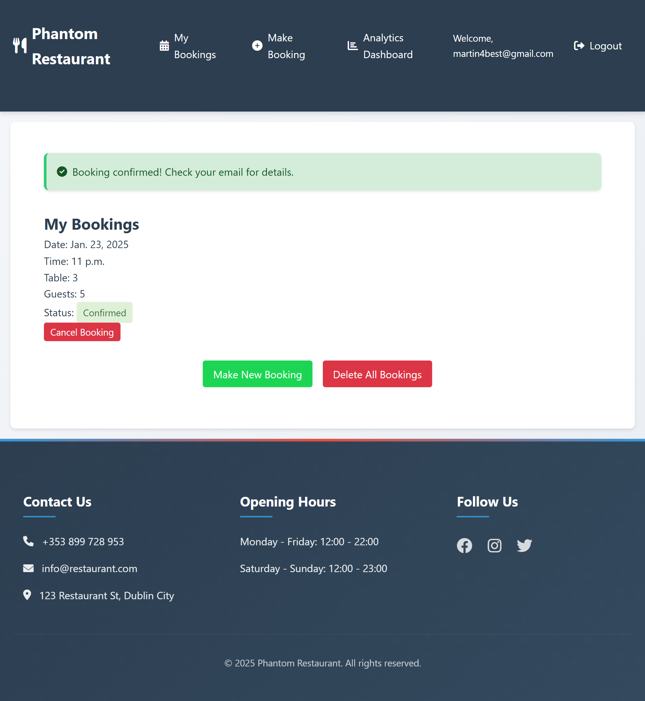

   ### Booking Analytics Page
   This is the page that Summarizes every booking trends such as the ```total_bookings, confirmed_bookings, cancelled_bookings,Customer_Feedback such as (rating (1-5 scale) and optional comment.), RevenueMetrics such as (Daily revenue, average revenue per booking, and per guest.)```
   This page also provides the insights into customer behavior such as the Total bookings, cancellations, spending, and dining preferences.

   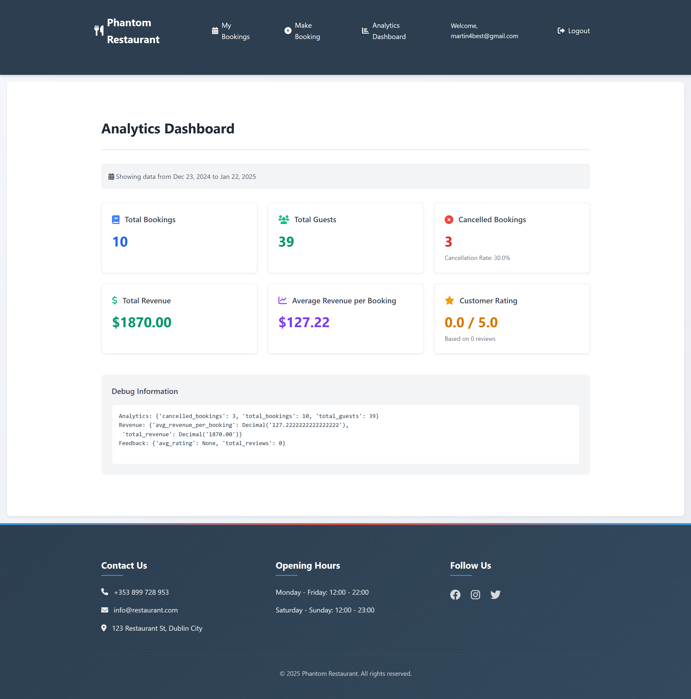

   ### NavBar
   It has a fully functional navbar:
   Large screen version
   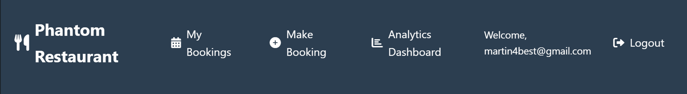

   Small screen version

   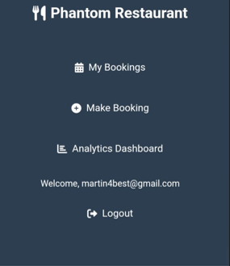

   You can see that every icons still appears on the NavBar, such as making a booking, viewing every of your booking confirmations you have made, and view the analytical page for every booking trends you have made so far, such as Total Revenue, Average Revenue per Booking and Total Guests etc.
   Everytime a booking is made, it says ```booking confirmed! Check your Email for details```

   

   immediately you received the confirmation email, it will automatically be updated on the admin panel, and the analytical dashboard

   ### Analytical Dashboard
   

   ### Admin Dashboard
   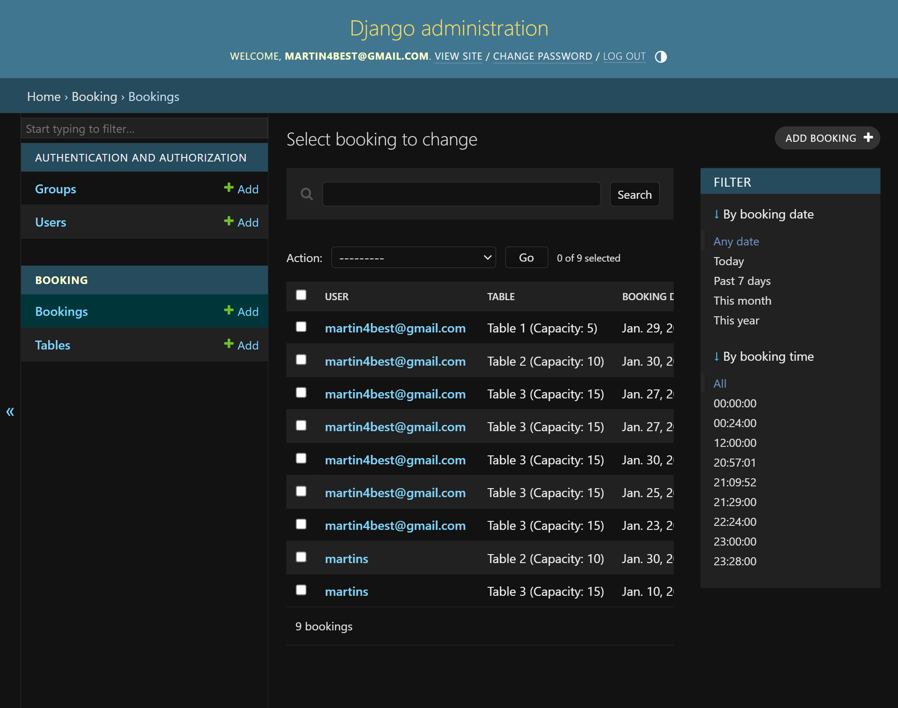

   ### Delete All Bookings
   Although if the customer want to cancel every booking, you have to scroll down to my bookings page, by highlighting ```Delete All Bookings```button below which will take you to a warning page for confirmation, before making a final decision.

   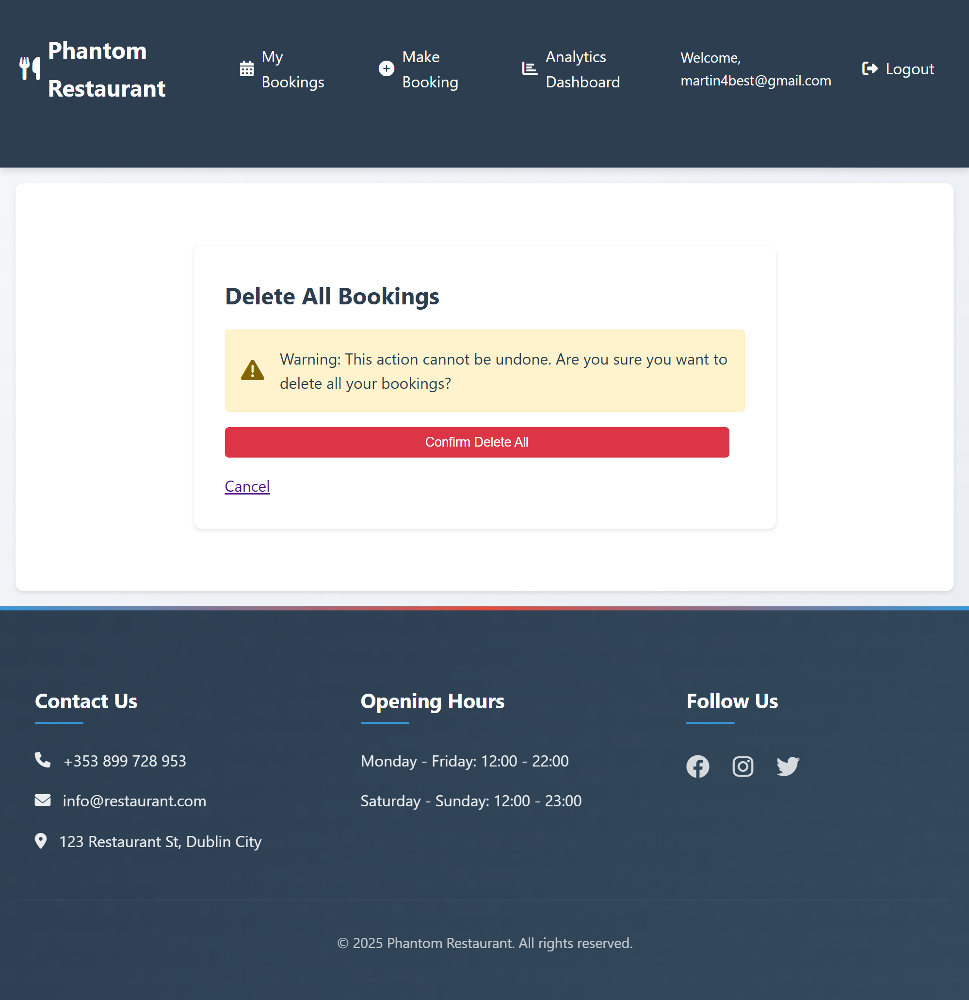


## Installation and Setup

   ### Prerequisites
   The following tools were installed during the cost of building this site.
   - Python 3.8+
   - Django 4.x
   - PostgreSQL (or SQLite for development)
   - Git
   - pip

   ### Clone the Repository
   I had to clone the repository to my local machine using 
   ```https://github.com/Ebuka-martins/restaurant_project.git ```

   ````
   cd restaurant_project
   `````

   ### Environment Setup
    I had to Create a virtual environment and activate it
    ```
    python3 -m venv env
    source env/bin/activate 
    ```
   I had to install dependencies, during the cause of creating this site 
   ```pip3 install -r requirements.txt```

   Furthermore I had to create an env.py file and configure environment variables directly:
   ```
   import os
   os.environ["SECRET_KEY"] = "my-secret-key"
   os.environ["DEBUG"] = "True"  # Set to "False" 
   os.environ["DATABASE_URL"] = "my-database-url"  
   ```
   ### Database Configuration
   By default, the system supports both PostgreSQL (preferred for production) and SQLite (default fallback).
   and Apply database migrations: 
   ```
   python3 manage.py makemigrations
   python3 manage.py migrate
   ```
   ### Running the Application
   Start the development server by ```python3 manage.py runserver```
   
   ### Running Tests
   Run the test suite by ```python3 manage.py test```

## Usage
During the creation of my site, I had to state a simple usage steps for simple users which are as follows:
   - Register or log in as a user.
   - Navigate to the booking page to reserve a table.
   - Use the dashboard to view, update, or cancel reservations.
   - Restaurant admins can manage tables and analyze customer trends.

## Stretch Goals for the Django Restaurant Booking System
### Client-Based Stretch Goals   
These goals focus on enhancing the user experience and meeting client expectations.
 #### 1. Dynamic Table Availability Visualization
   - Add a real-time visual representation of table availability using a graphical layout of the restaurant.
   - Highlight available, booked, and reserved tables.
 #### 2. Loyalty Program Integration
   - Implement a rewards system where customers earn points for every booking or feedback submission.
   - Allow customers to redeem points for discounts or exclusive offers.   
 #### 3. Mobile App Compatibility
   - Develop a companion mobile app to make bookings, view menus, and provide feedback more conveniently.
   - Add push notifications for booking reminders and promotions.   
 #### 4. Personalized Recommendations
   - Use customer insights (e.g., preferred dining times and average group size) to offer personalized booking time slots or menu suggestions.   
 #### 5. Feedback-Based Promotions
   - Analyze customer feedback and automatically send personalized promotions or apologies based on ratings.
 #### 6. Special Event Bookings      
   - Allow customers to book tables for special occasions (e.g., birthdays, anniversaries) with customization options such as decorations and special menus.
 #### 7. Special Event Bookings    
   - Seamless Payment Integration
   - Include options for split payments or paying for the meal in advance.
### Developer-Based Stretch Goals
These goals focus on system scalability, maintainability, and developer experience.
#### 1. Automated Testing Suite
   - Develop a comprehensive automated testing framework to cover unit, integration, and end-to-end tests.
   - Include stress tests to simulate high booking traffic.
#### 2. Improved Analytics Dashboard
   - Add more advanced analytics such as customer retention rates, average revenue growth, and peak booking hours.
#### 3. Performance Optimization  
   - Implement caching (e.g., using Redis) for frequently accessed data like table availability and menu items.

## Development Plan for Phantom Restaurant System
### 1.  Models Implementation
   ### Tables:
   ✅ Design Table models to manage table capacity and availability.
   ### Bookings:
   ✅ Create Booking models with fields for user details, table assignment, date, time, and status. Enforce constraints to prevent double-booking via unique_together.
   ### Feedback:
   ✅ Include a CustomerFeedback model for users to rate their experiences and leave comments.
   ### Analytics:
   ✅ Add BookingAnalytics and RevenueMetrics models to track operational data, such as booking trends and revenue. Include a CustomerInsights model for user-specific metrics.
### 2. Forms
   ✅ Develop BookingForm to collect user inputs for reservations and validate data (e.g., number of guests).
### 3. Views
   ### Make Booking:
   ✅ Implement the make_booking view to handle reservation logic.

   ✅ Match guest count with table capacity.

   ✅ Ensure availability for the selected time and date.

   ✅ Automatically update analytics and revenue data after successful booking.
   ### Booking List:
   ✅ Allow users to view their upcoming and past reservations with the booking_list view.
   ### Cancel Booking:
   ✅ Provide a mechanism to cancel reservations and reflect these changes in analytics.
   ### Delete All Bookings:
   ✅ Add functionality to allow users to delete all their bookings, while updating related metrics and feedback records.
   ### Analytics Dashboard:
   ✅ Create an admin dashboard (AnalyticsDashboardView) for viewing and analyzing booking trends, feedback ratings, and revenue over time.

## Entity Relationship Diagram   
   **DBdiagram Charts**
      * The starting point for the entity relationships was drawn up as a entity relationship diagram using [dbdiagram charts](https://dbdiagram.io/home), and was shown as follows below
     
   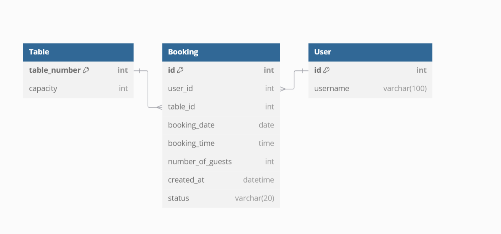
    **Relationship**
   - **User** → **Booking:** One user can make multiple bookings.
   - **Table** → **Booking:** One table can be associated with multiple bookings.

As part of this process I used a kanban board to monitor user stories, and ensure I complete everything the client wanted, as Shown below is a screenshot of the kanban board I created for this project.   

| 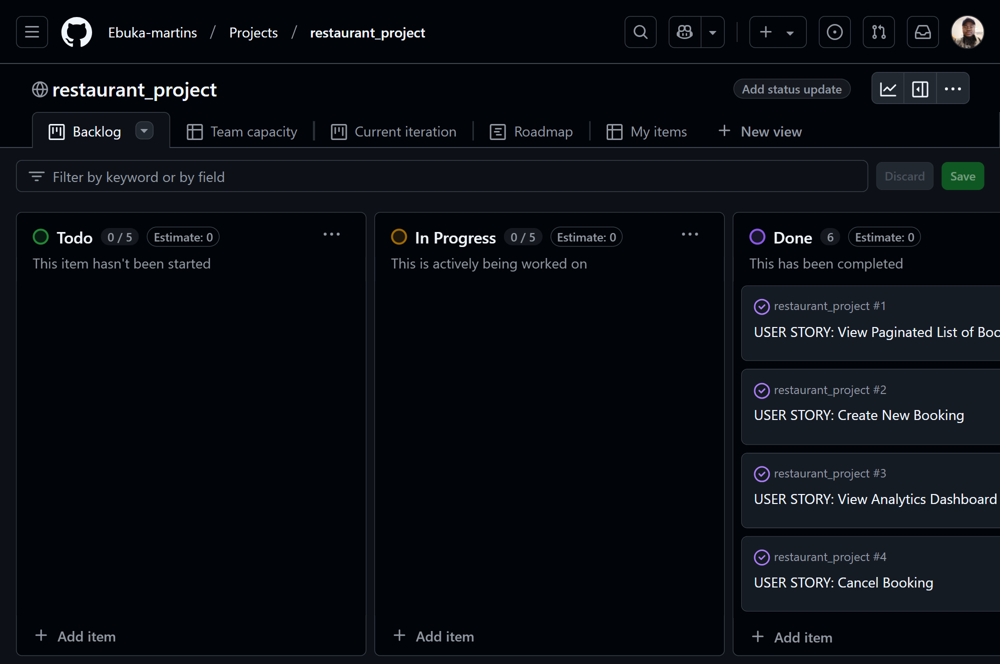 | 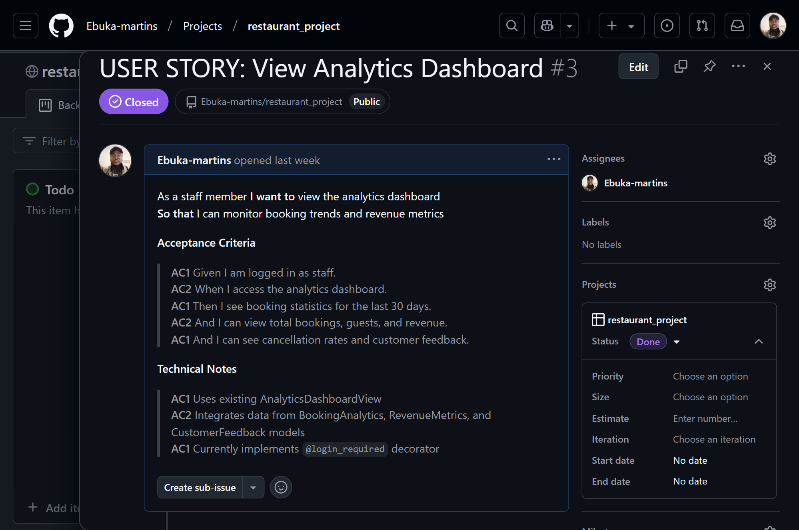 |
|:-------------------------------------------:|:-------------------------------------------:|
| **Kanban board** | **Kanban Issue** |


## Design 
### Color Design

  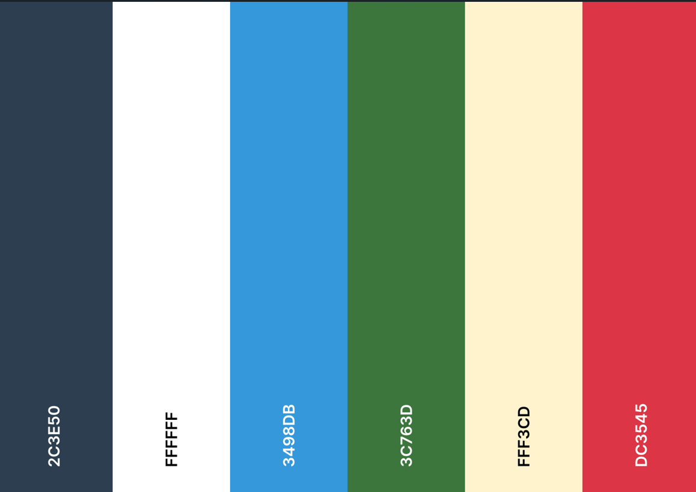 

  - White color was used as the font text of the website and the background color of the website.
  - Charcoal color was used as the design background for button, tables and hovering color that appears on the booking page section when the you cursor.
  - Celestial Blue was used as the background color of the button and on the details section on the book table page section.
  - Fern Green color was also used as background color for make booking buttons at my bookings page.
  - Cornsilk color was also used as the warning background color that appears when you want to delete all bookings.
  - Rusty Red Color is used as the background color for cancel booking buttons at my bookings page.

## Technologies

This is a list of technologies I used while building this site:
***

- Django Framework - version 4.2.17
- Django Crispy forms - version 2.1
- gunicorn - version 20.1.0
- psycopg2-binary - version 2.9.10
- coverage - version 7.6.10
- whitenoise - version 6.8.2
- dj-database-url - version 2.3.0
- asgiref - version 3.8.1
- iniconfig - version 2.0.0
- pluggy - version 1.5.0
- pytest - version 8.3.4
- pytest-django - version 4.9.0
- python-dotenv - version 1.0.1
- sqlparse - version 0.5.3
- pip - version 24.0
- [](https://www.python.org/) used for the functionality of the inside gubins of the website.
- [](https://en.wikipedia.org/wiki/HTML) used for the main site content.
- [](https://en.wikipedia.org/wiki/CSS) used for the main site design and layout.
- [](https://www.javascript.com) used for user interaction on the site.
- [](https://git-scm.com) used for version control. (`git add`, `git commit`, `git push`)
- [](https://gitpod.io) used as a cloud-based IDE for development.
- [](https://github.com) used for secure online code storage.
- [](https://www.heroku.com/) Used to deploy the project.
- [](https://developer.chrome.com/docs/devtools) Dev Tools Used For page inspection and checking website.
- [](https://codeinstitute.net/global/) Gitpod Template - to generate the workspace for the project.
- [](https://dbdiagram.io/home) used to make the ERD's for database interactions.


## Technologies used to Design the website
***

- [TechSini](https://techsini.com/multi-mockup/) To create mockup image.
- [FontAwesome](https://fontawesome.com/) Icons.
- [Goggle Fonts](https://fonts.google.com/) For website fonts.
- [](https://favicon.io/) used for creating the website Logo.

This is a list of technologies I used to manually test both the code and the accessibility:
***

- [ColorPicker](https://coolors.co/) to give different color compactability.
- Google Chrome's [Lighthouse](https://developer.chrome.com/docs/lighthouse/overview/) to check accessibility.
- [WAVE Web Accessibility Evaluation Tools](https://wave.webaim.org/) used to spot check individual pages.
- [W3C HTML Markup Validator](https://validator.w3.org/) to check HTML code.
- [W3C Jigsaw CSS Validator](https://jigsaw.w3.org/css-validator/) to check CSS code.
- [ESlint javascript validator](https://eslint.org/) to check javascript code.
- [pep8 python validator](https://pep8ci.herokuapp.com/#) to check python code.

  

