# Phantom Restaurant Booking System Testing

Return to [README](README.md).

## Table of contents

  1. [**SYSTEM Testing**](#SYSTEM-Testing)
     - [**Manual Testing Table**](#Manual-Testing-Table)
     - [**Automatic Testing Table**](#Automatic-Testing-Table)
  2. [**Overall Performance**](#Overall-Performance)
  3. [**Responsiveness & Compactability Testing**](#Responsiveness-&-Compactability-Testing)
  5. [**Code Validation**](#Code-Validation)
  6. [**Wave Test Report**](#Wave-Test-Report)
  7. [**JavaScript Testing**](#JavaScript-Testing)
        - **JS Hint**
  8. [**Python Testing**](#Python-Testing)
     - [**CI Python Linter**](#CI-Python-Linter)
  9. [**Summary**](#Summary)
   

  
  ------

## SYSTEM Testing

I conducted both Manual and Automatic testing for the
- **Booking List**
- **Create Booking**
- **Cancel Booking**
- **DeleteAll Bookings**
- **Analytics Dashboard**

---

### Manual Testing Table

In total I constructed 5 tests to test the majority of the functions within the Table, broken down into 5 sections:
This expanded table provides a comprehensive manual breakdown of expected outcomes, covering technical, functional, and data integrity aspects of each test scenario.

 | **Category** | **Test Method**| **Expected Outcome** | **Detailed Validation Criteria** | **passed** | **comments** |
| --- | --- | --- | --- | --- | --- |
| **Booking List** | Authenticated View |  HTTP 200 OK status code |  Verify response is successful | Yes | - |
|  |  |  Correct template rendered |  Check 'booking/booking_list.html' is used | Yes | - |
|  |  |  Booking details displayed |  Validate table number appears | Yes | - |
|  |  |   |  Confirm guest count shown | Yes | - |
|  |  |   |  Check booking status visible | Yes | - |
|  |  | Correct booking in context  |  Verify single booking object | Yes | - |
|  |  |   |  Check booking matches created instance | Yes | - |
| **Booking List** | Unauthenticated View | Redirect to login page |  HTTP 302 redirect status | Yes | - |
|  |  | Preserve intended destination | Next parameter set to root URL '/' | yes | - |
|  |  | Prevent unauthorized access | No booking list details exposed | Yes | - |
| **Create Booking** | Successful Booking | Successful booking creation | Booking object created in database | Yes | - |
|  |  | Correct booking details | Validate date matches input | Yes | - |
|  |  |  | Verify time matches input | Yes | - |
|  |  |  | Check guest count accuracy | Yes | - |
|  |  | Automatic status assignment | Status set to 'confirmed' | Yes | - |
|  | | Analytics update | Total bookings incremented | Yes | - |
|  |  |  | Total guests count updated | Yes | - |
| **Cancel Booking** | Booking Cancellation | Successful cancellation | Booking status changed to 'cancelled' | Yes | - |
|  |  | Redirect to booking list | HTTP 302 redirect to booking list | Yes | - |
|  |  | Analytics tracking | Cancelled bookings count incremented | Yes | - |
|  | | Database state update | Original booking record modified | Yes | - |
| **Delete All Bookings** | Bulk Deletion | Remove all user bookings | Zero bookings for specific user | Yes | - |
|  |  | Analytics reset | Total bookings count set to 0 | Yes | - |
|  |  | Successful redirection | Redirect to booking list page | Yes | - |
| **Analytics Dashboard** | Dashboard View | Successful page load | HTTP 200 OK status code | Yes | - |
|  |  | Correct template used | 'booking/analytics_dashboard.html' rendered | Yes | - |
| | | Context data availability | Analytics data present | Yes | - |
|  |  |  |  Revenue metrics included | Yes | - |
|  |  | Data accuracy | Matches pre-created test data | Yes | - |

---

### Automatic Testing Table

| 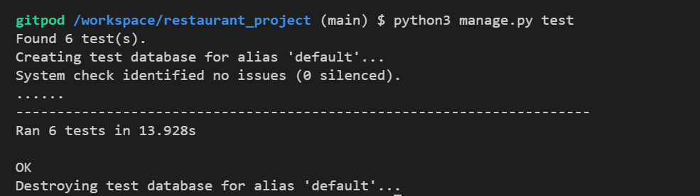 | 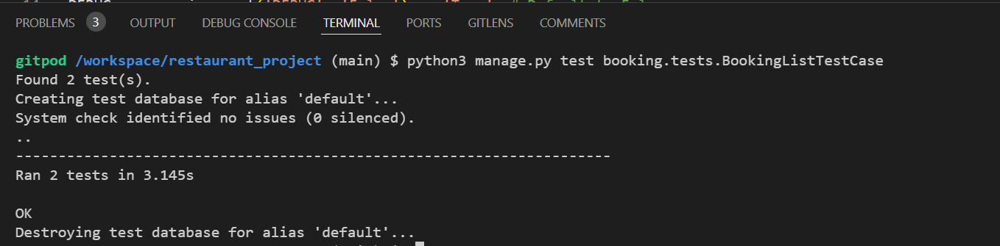 |
|:-------------------------------------------:|:-------------------------------------------:|
| **Overall Test output** | **BookingList Test Output** |
| 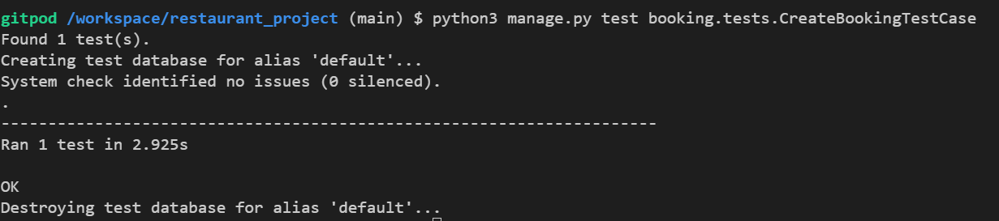 | 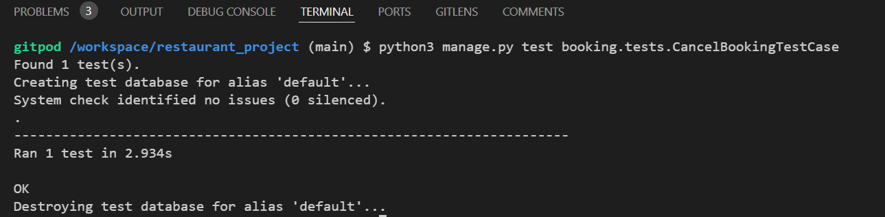 |
| **CreateBooking Test Output** | **CancelBooking Test Output** |
| 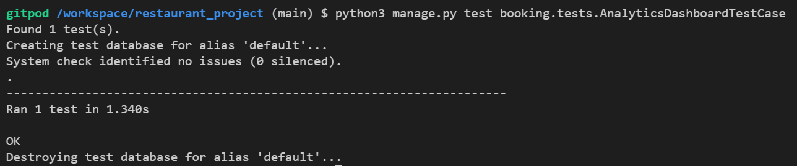 |
| **Analytics Test Output** |

---

## Overall Performance

The complete site was tested on the lighthouse facility in Google Developer Tools to assess the overall performance of the site. The site meets the pass criteria and you can see the results in the below table.

| Page         | Screenshot                                                      | Notes          |
|--------------|-----------------------------------------------------------------|----------------|
|Login-Section page   |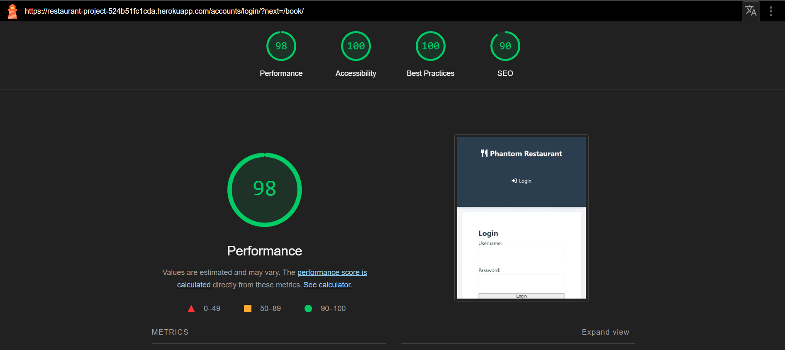 |  Meets criteria|                        
|MyBooking-Section page   |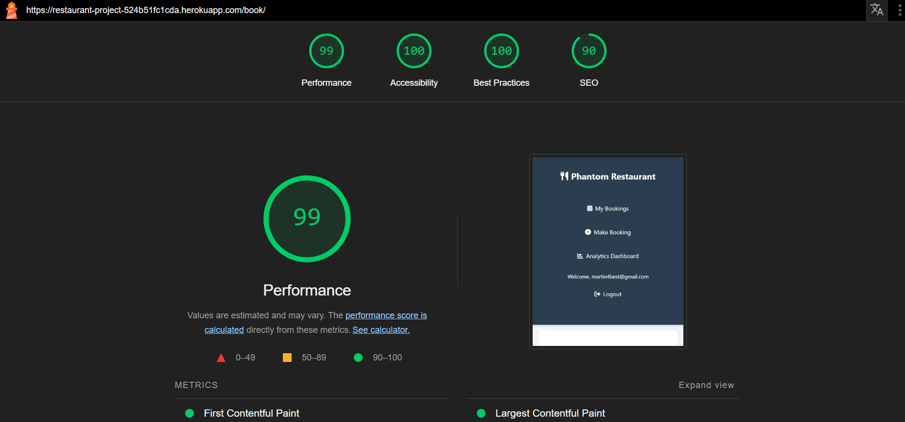 |  Meets criteria|                        
| MakeBooking-Section Page | |  Meets criteria |                        
| Analytics-Section Page | |  Meets criteria |                        
| DeleteAll-Section Page |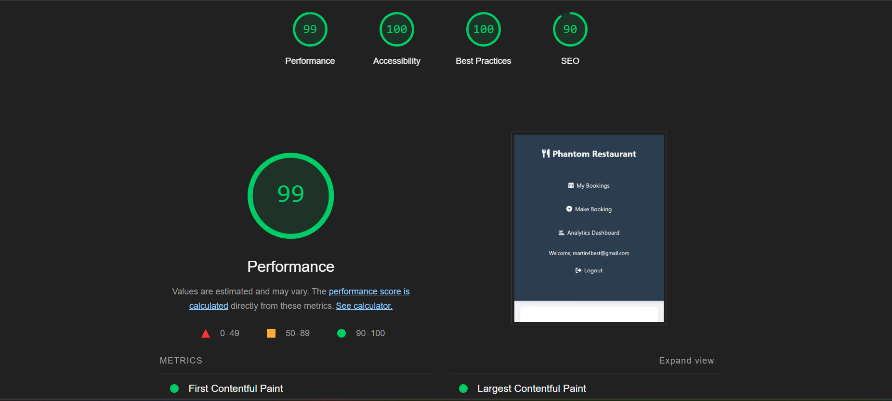 |  Meets criteria |                        
| Menu-Section Page |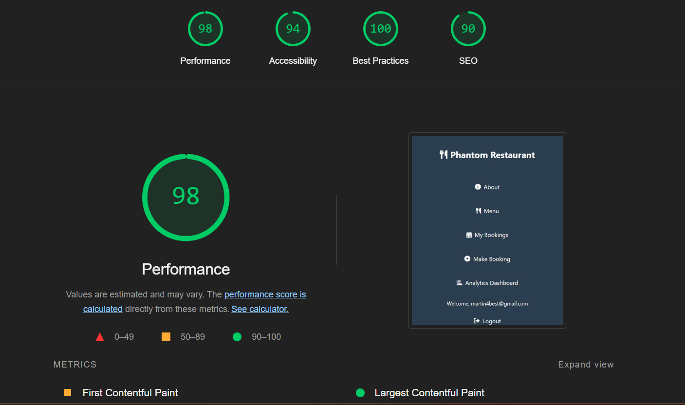 |  Meets criteria |                     
| About-Section Page | |  Meets criteria |                        

---

## Responsiveness & Compactability Testing

To ensure a broad range of users can successfully use this site, I tested it across the 3 major browsers in both desktop and mobile configuration.

- Chrome Browser
- Edge Browser
- Mozilla Firefox Browser

For testing compatibility, I created the correct functionality and appearance across devices, the website was tested on the following browsers: Chrome, Firefox and Microsoft Edge.

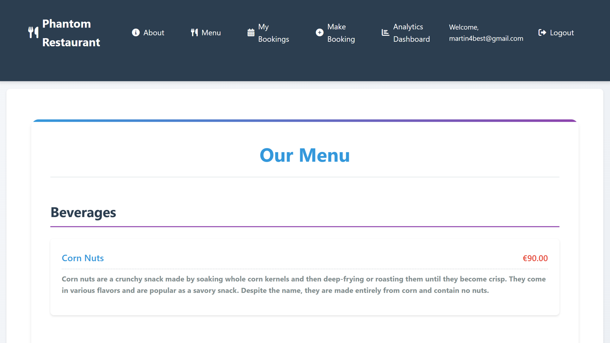

------

## Code Validation

The W3C Markup Validator and W3C CSS Validator Services were used to validate every page of the project to ensure there were no syntax errors in the project. The results and screenshots are in the table below.

| Page                 | Screenshot Link                                                                   | Notes  |
|----------------------|-----------------------------------------------------------------------------------|--------|
|base.html            |[view here](booking/static/booking/image/base-htmlvalidation.png)           | Passed | 
|login.html            |[view here](booking/static/booking/image/LoginPage-Validation.png)           | Passed |
|makeBooking.html           |[view here](booking/static/booking/image/Make-BookingValidation.png)          | Passed |
|dashboard.html        |[view here](booking/static/booking/image/AnalyticsDashboard-Validation2.png)       | Passed | 
|my-Booking.html  |[view here](booking/static/booking/image/MyBooking-Validator.png) | Passed |
|menu.html  |[view here](booking/static/booking/image/menu-page.png) | Passed |
|About.html  |[view here](booking/static/booking/image/menu-page.png) | Passed |
|CSS       |[view here](booking/static/booking/image/CSS-Validation.png)       | Passed | 

##### back to [top](#table-of-contents)

------

 ## Wave Test Report

  - wave test report was used to test the webpage performance and functions in different environments or at different times.

  
| Test      | Screenshot                                              | Notes                                                   |
|-----------|---------------------------------------------------------|---------------------------------------------------------|
| Wave Test  | 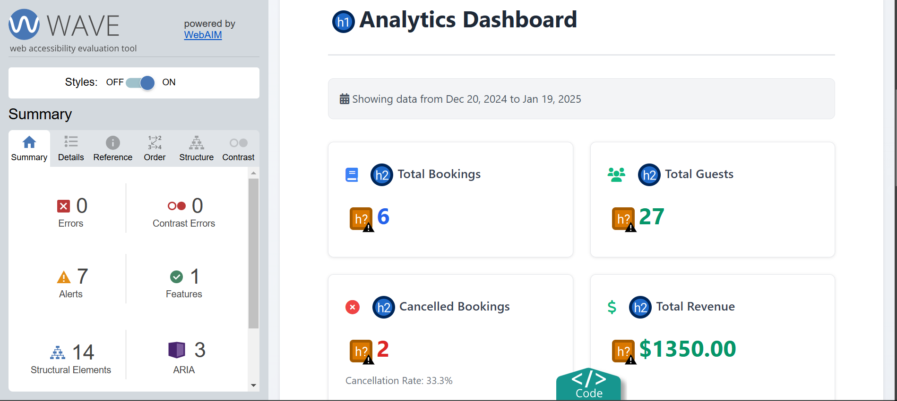   | Passed - No Error where found. |

------

## JavaScript Testing

### JS Hint

  * All JavaScript code was put though [JS Hint](https://jshint.com/) 

| Test      | Screenshot                                              | Notes                                                   |
|-----------|---------------------------------------------------------|---------------------------------------------------------|
| JS Hint   |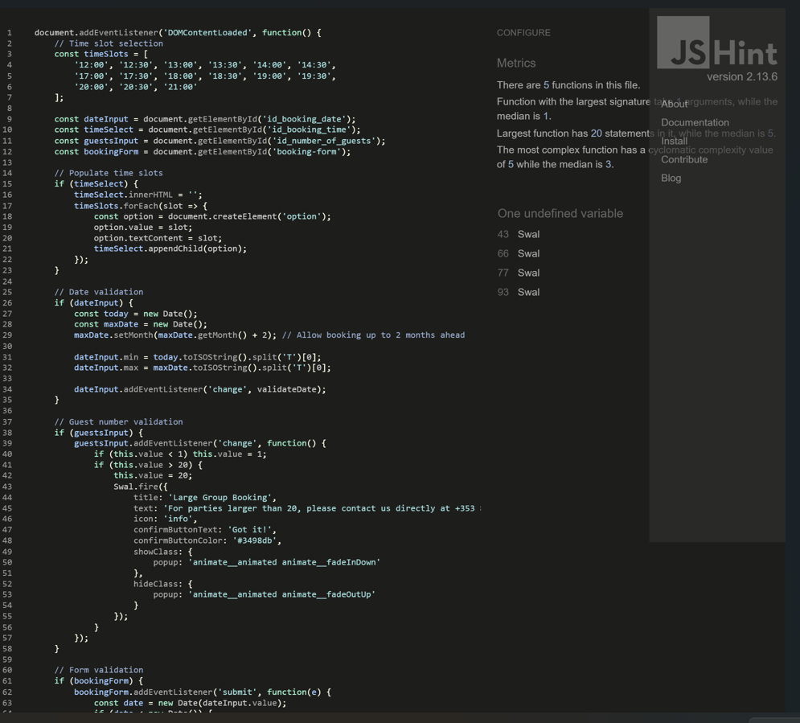      | Passed - No warnings. 1 undefined variable as expected. |

------

## Python Testing

### CI Python Linter

  * All Python code in app.py was put though [CI Python Linter](https://pep8ci.herokuapp.com/) 

| Test      | Screenshot                                                                                   | Notes                                                |
|----------------------------|-----------------------------------------------------------------------------|------------------------------------------------------|
| admin.py           |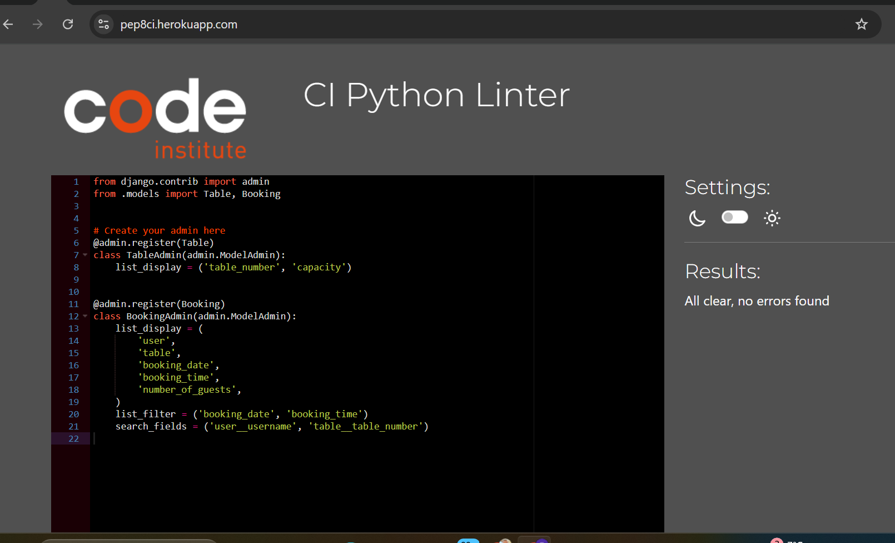 |  passed - No warnings|
| apps.py |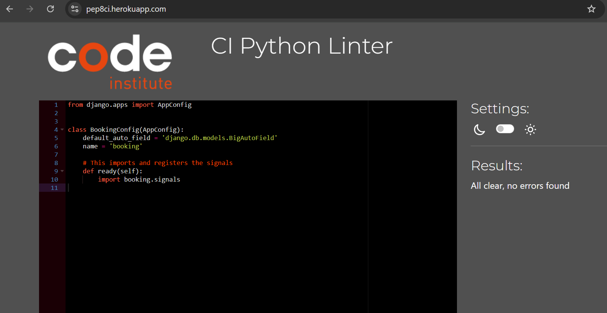    |  Passed - No warnings           | 
| forms.py               |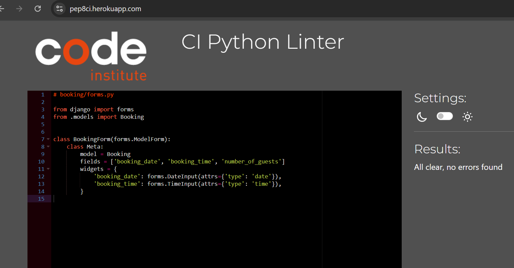      |  passed - No warnings |
| models.py |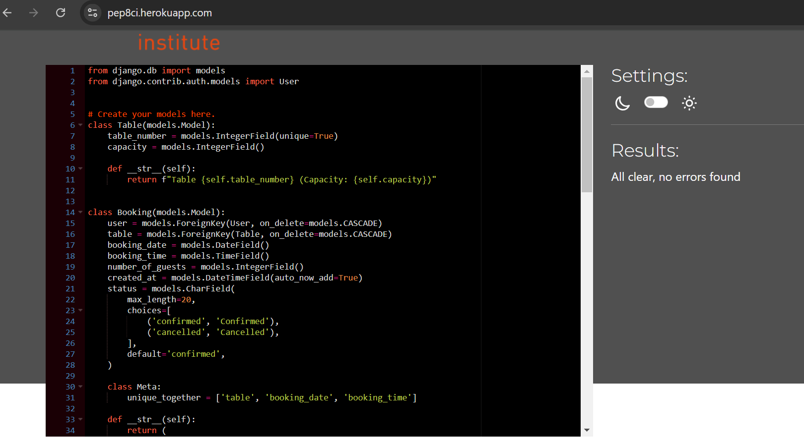        |  passed - No warnings |
| settings.py |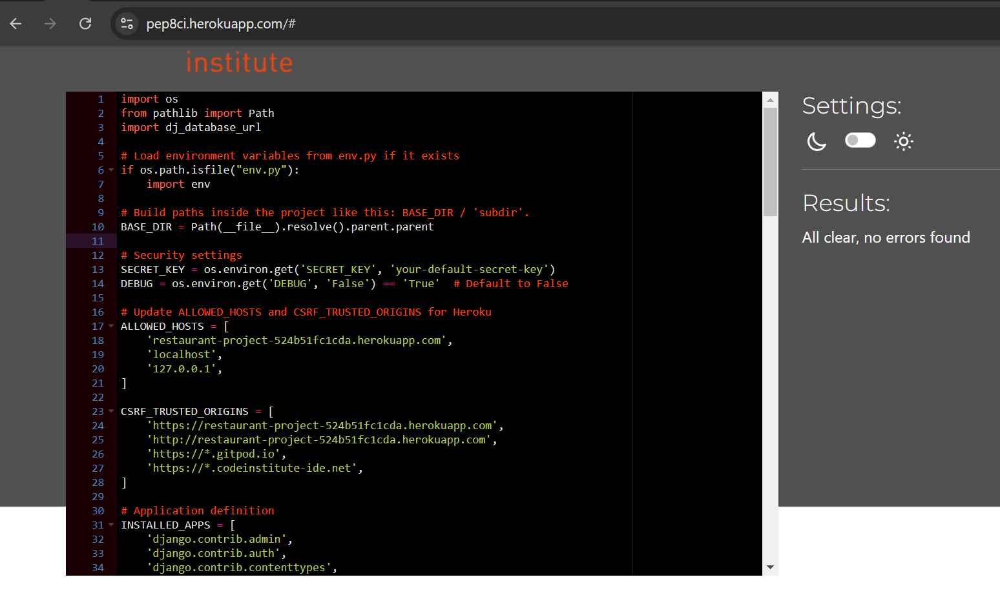    |  Passed - No warnings   |
| signals.py |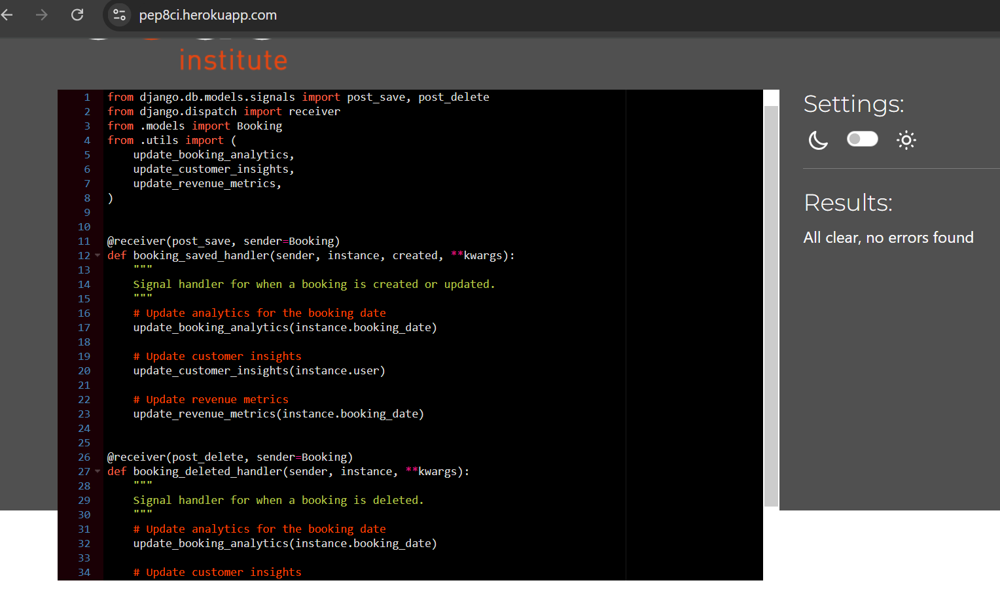    |  Passed - No warnings   |
| tests.py |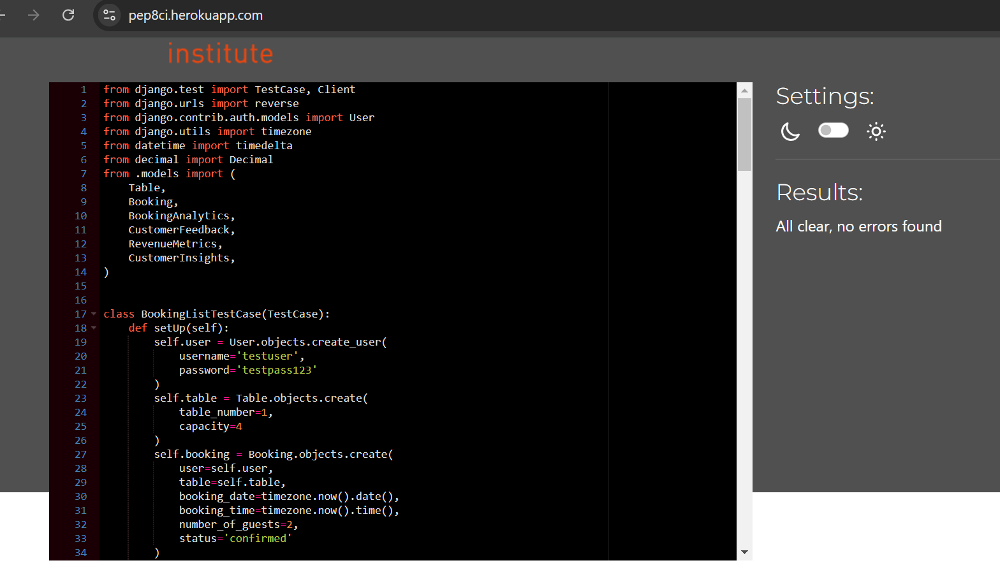    |  Passed - No warnings   |
| urls.py |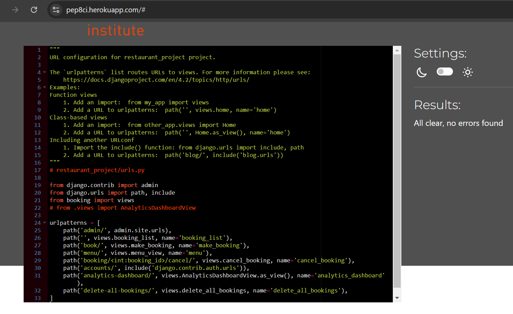    |  Passed - No warnings   |
| views.py |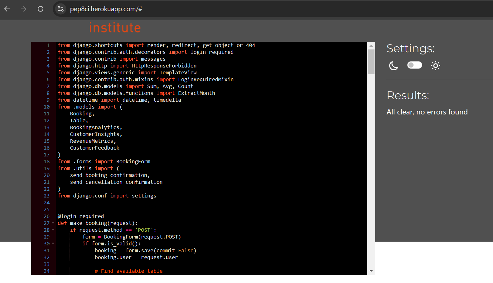    |  Passed - No warnings   |

## Summary

After initially correcting the code format and it passing testing using the CI python linter it seemed that the indentation after breaking a line due to line length wasnt quite aesthetically correct, although meeting pep8 guldlines. The apps.py file was the reverted back to the tested and passed version that was verified by CI python linter, as this meant that  the beautifier tool was not pep8 compliant. As the criteria for this project is that python is to be pep8 compliant, using results and testing of the CI python linter was the most reliable approach.

##### back to [top](#table-of-contents)

------